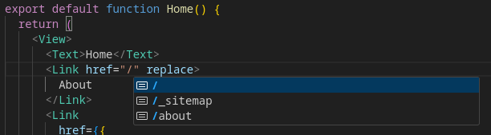

# Proyecto de Práctica: Navegación con Expo Router

Este proyecto es una práctica para entender la navegación usando `expo-router`.

## Configuración Inicial

El proyecto se inició con:

```bash
npx create-expo-app@latest --template
```

Eligiendo la plantilla:

```bash
Blank (Typescript)
```

## Instalación de Dependencias

Instala las dependencias necesarias para `expo-router`:

```bash
npx expo install expo-router react-native-safe-area-context react-native-screens expo-linking expo-constants expo-status-bar
```

## Configuración de Archivos

### `package.json`

Configura el punto de entrada de la aplicación:

```json
{
  "main": "expo-router/entry"
}
```

### `app.json`

Define el esquema para la navegación:

```json
{
  "schema": "myapp"
}
```

### `babel.config.js`

Si usas SDK 49 o inferior, añade la configuración de Babel:

```javascript
module.exports = function (api) {
  api.cache(true);
  return {
    presets: ["babel-preset-expo"],
    plugins: ["expo-router/babel"],
  };
};
```

Luego, limpia el caché de Expo:

```bash
npx expo start -c
```

## Ejecución del Proyecto

Para iniciar el proyecto, utiliza:

```bash
npm run start
```

Al abrir la aplicación, verás la siguiente imagen:


Al hacer clic en el botón blanco `touch app/index.tsx`, se creará automáticamente la ruta en tu proyecto y se mostrará una vista en blanco con el mensaje `Hello world`.

## Configuración de Rutas

### Rutas Básicas

Las rutas en Expo Router se manejan mediante la estructura de carpetas, similar a Next.js:

```
myapp/
├── app/
│   ├── _layout.tsx          -> Ruta base
│   ├── index.tsx            -> Ruta "/"
│   ├── about.tsx            -> Ruta "/about"
│   ├── user/
│       ├── index.tsx        -> Ruta "/user"
│   ├── (auth)/
│       ├── sign-in/
│           ├── index.tsx    -> Ruta "/sign-in"
```

### Rutas Dinámicas

Puedes manejar parámetros dinámicos con archivos nombrados entre corchetes:

```
myapp/
├── app/
│   ├── [userId].tsx         -> Ruta "/:userId"
│   ├── posts/
│       ├── [postId].tsx     -> Ruta "/posts/:postId"
```

## Navegación entre Páginas

Expo usa el componente `<Link>` de `expo-router` para la navegación:

### Ejemplo: `app/index.tsx`

```typescript
import { View } from "react-native";
import { Link } from "expo-router";

export default function Page() {
  return (
    <View>
      <Link href="/about">About</Link>
    </View>
  );
}
```

### Ejemplo Personalizado: `app/about/index.tsx`

```typescript
import { View, Text, Pressable } from "react-native";
import React from "react";
import { Link } from "expo-router";

export default function About() {
  return (
    <View>
      <Link href="/" asChild>
        <Pressable>
          <Text>Home</Text>
        </Pressable>
      </Link>
    </View>
  );
}
```

El componente `Link` por defecto envuelve sus hijos en un componente `<Text>`, pero puedes personalizarlo usando `asChild` para transferir las propiedades al primer hijo.

## Navegación Nativa

Expo Router utiliza una navegación basada en pilas, donde cada nueva ruta se agrega a la pila de navegación. Usa la propiedad `push` en el componente `<Link>` para agregar una nueva ruta a la pila, y `replace` para reemplazar la ruta actual sin agregarla.

### Ejemplo: Reemplazar una Ruta

```typescript
import { View } from "react-native";
import { Link } from "expo-router";

export default function Page() {
  return (
    <View>
      <Link href="/about" replace>
        About
      </Link>
    </View>
  );
}
```

Al usar `replace`, si navegas a "About" y luego retrocedes, no volverás a la ruta anterior, ya que la ruta previa fue reemplazada.

### Uso de `replace`

Supongamos que tenemos una encuesta en la aplicación que el usuario solo debe responder una vez. Cuando el usuario termine la encuesta y necesite moverse a otra ruta, puedes usar `replace` para asegurarte de que no pueda regresar a la página de la encuesta, evitando que vuelva a verla después de completarla.

## Navegación a Rutas Dinámicas

El componente `Link` tiene un atributo `href` que puede recibir un string con la ruta a la que va a navegar o un objeto con la configuración de la ruta, incluyendo parámetros dinámicos.

```tsx
<Link
  href={{
    pathname: "/user/[userId]",
    params: { userId: 1 },
  }}
>
  User 1
</Link>
```

## Navegación Imperativa

También puedes navegar de forma imperativa utilizando el objeto `router`. Esto es útil cuando necesitas realizar una acción de navegación fuera de un componente React, como en un manejador de eventos o una función de utilidad.

### Ejemplo:

```typescript
import { router } from "expo-router";

export function logout() {
  router.replace("/login");
}
```

### Funciones del objeto `router`:

- **`navigate`**: Navega a una ruta.
- **`push`**: Agrega una nueva ruta a la pila.
- **`replace`**: Reemplaza la ruta actual.
- **`back`**: Retrocede a la ruta anterior.
- **`canGoBack`**: Verifica si es posible retroceder.
- **`setParams`**: Actualiza los parámetros de la ruta actual.

## Autocompletado de Rutas

(Para proyectos configurados con TypeScript)

Expo Router permite la generación automática de tipos TypeScript usando Expo CLI, lo que habilita el autocompletado en `<Link>` y la API de hooks con tipado estático. **Esta característica está actualmente en fase beta y no está habilitada por defecto.**

Si el proyecto fue creado con la plantilla `Navigation`, esta funcionalidad ya está activada.

### Habilitación Manual:

Añade lo siguiente en `app.json`:

```json
{
  "expo": {
    "experiments": {
      "typedRoutes": true
    }
  }
}
```

Luego, ejecuta en la terminal:

```bash
npx expo customize tsconfig.json
```

Esto agregará la configuración necesaria a `tsconfig.json`.

### Uso del Autocompletado

Una vez configurado, los componentes que usan `Href<T>` tendrán autocompletado de rutas en tu aplicación. Sin embargo, en las rutas dinámicas, no habrá autocompletado automático, aunque TypeScript mostrará errores si la ruta es incorrecta.

Esta funcionalidad también se aplica al objeto `useRouter()`.



## Rutas Layout

Para configurar las rutas layout, elimina todos los archivos dentro de la carpeta `app/`, dejando solo `index.tsx` y `_layout.tsx`.

### `app/_layout.tsx`

```typescript
import React from "react";
import { Slot } from "expo-router";

export default function RootLayout() {
  return <Slot />;
}
```

En este ejemplo, el componente `Slot` funciona como `children` en React, indicando dónde se renderizará la ruta hija actual.

```typescript
import React from "react";
import { Slot } from "expo-router";
import { Text } from "react-native";

export default function RootLayout() {
  return (
    <>
      <Text>Header</Text>
      <Slot />
      <Text>Footer</Text>
    </>
  );
}
```

De manera similar a React o Next.js, puedes usar layouts para que ciertos componentes, como un encabezado o pie de página, persistan durante la navegación en la aplicación.

## Layouts y Grupos

Como ya se meciono Expo permite la agrupacion de rutas por contexto

```
myapp/
├── app/
│   ├── (app)/
│       ├── index.tsx               -> Ruta "/"
│       ├── settings.tsx            -> Ruta "/settings"
│   ├── (legal)/
│       ├── terms-of-services.tsx   -> Ruta "/terms-of-services"
│       ├── privacy-policy.tsx      -> Ruta "/privacy-policy"
```

Esto se hace paraa evitar segmentos que talvez no son necesarios, en este ejemplo en lugar de tener la ruta

`/app/settings` o `/legal/terms-of-services`

Solo tenemos las rutas

`/settings` y `/terms-of-servicecs`

Cada uno de estos grupos podria tener diferentes layouts, por ejemplo

```
myapp/
├── app/
│   ├── (app)/
│       ├── index.tsx               -> Ruta "/"
│       ├── settings.tsx            -> Ruta "/settings"
│       ├── _layout.tsx
│   ├── (legal)/
│       ├── terms-of-services.tsx   -> Ruta "/terms-of-services"
│       ├── privacy-policy.tsx      -> Ruta "/privacy-policy"
│       ├── _layout.tsx
```

Lo que haremos es navegar de `"/"` -> `"/settings"` -> `"/terms-of-services"` -> `"/privacy-policy"` -> `"/"`

### `(app)/_layout.tsx`

```typescript
import { Text } from "react-native";
import React from "react";
import { Slot } from "expo-router";

export default function RootLayout() {
  return (
    <>
      <Text>Header</Text>
      <Slot />
      <Text>Footer</Text>
    </>
  );
}
```

### `(legal)/_layout.tsx`

```typescript
import { Text } from "react-native";
import React from "react";
import { Slot } from "expo-router";

export default function LegalLayout() {
  return <Slot />;
}
```

### `(app)/index.tsx`

```typescript
import { View, Text } from "react-native";
import React from "react";
import { Link } from "expo-router";
import styles from "../../styles/styles";

export default function Home() {
  return (
    <View>
      <Text style={styles.title}>Home</Text>
      <Link href={"/(app)/settings"} style={styles.link}>
        Navegar a /settings
      </Link>
    </View>
  );
}
```

### `(app)/setings.tsx`

```typescript
import { View, Text } from "react-native";
import React from "react";
import { Link } from "expo-router";
import styles from "../../styles/styles";

export default function Settings() {
  return (
    <View>
      <Text style={styles.title}>Settings</Text>
      <Link href={"/(legal)/terms-of-services"} style={styles.link}>
        Navegar a /terms-of-policy
      </Link>
    </View>
  );
}
```

### `(legal)/terms-of-privacy.tsx`

```typescript
import { View, Text } from "react-native";
import React from "react";
import { Link } from "expo-router";
import styles from "../../styles/styles";

export default function TermsOfServices() {
  return (
    <View>
      <Text style={styles.title}>Terms of services</Text>
      <Link href={"/(legal)/privacy-policy"} style={styles.link}>
        Navegar a /privacy-policy
      </Link>
    </View>
  );
}
```

### `(legal)/privacy-policy.tsx`

```typescript
import { View, Text } from "react-native";
import React from "react";
import { Link } from "expo-router";
import styles from "../../styles/styles";

export default function PrivacyPolicy() {
  return (
    <View>
      <Text style={styles.title}>Privacy Policy</Text>
      <Link href={"/(app)"} style={styles.link}>
        Navegar a /
      </Link>
    </View>
  );
}
```

<video src="./public/readme/video1.mp4" width="200" controls>
  Tu navegador no admite la etiqueta de video.
</video>

El commit en donde se encuentra este ejemplo es: `6e937594b8dd86c24c66c5209baa319bab29e7ba`

En este ejemplo podemos observar que el header y footer del `RootLayout` solo aparece en la rutas que estan dentro del grupo `(app)`

## Stack

Android y IOS, tienen diferentes maneras de animar la forma en la que se apilan las vistas, en Android se apilan sobre la pantalla actual, en IOS se animan desde la derecha. Borrare el ejercicio anterior.

Dejando la siguiente estructura:

```
myapp/
├── app/
│   ├── _layout.tsx
│   ├── index.tsx
│   ├── details.tsx
```

Esta estructura produce un layout donde el `index.tsx` es la primera ruta en el stack

### `_layout.tsx`

```typescript
import React from "react";
import { Stack } from "expo-router";

export default function RootLayout() {
  return <Stack />;
}
```

### `index.tsx`

```typescript
import { View, Text } from "react-native";
import React from "react";
import styles from "../styles/styles";

export default function Home() {
  return (
    <View style={styles.container}>
      <Text>Home</Text>
    </View>
  );
}
```

El componente `Stack` nos agrega automáticamente un header con el nombre de la ruta en la que estamos posicionados, lo cual facilita la navegación dentro de la aplicación. Además, el `Stack` contiene un prop llamado `screenOptions`, que ofrece múltiples propiedades configurables. Estas propiedades permiten personalizar aspectos como la visibilidad del header, el título de la pantalla, las animaciones de transición, y otros comportamientos específicos de cada pantalla dentro del stack.

- Cambio de color del background del header

```typescript
headerStyle: {
          backgroundColor: "#8147ff",
        }
```

- Cambio del color del texto del header

```typescript
headerTintColor: "#ffffff",
```

- Hacer transparente el header

```typescript
headerTransparent: true,
```

- Desaparece el header

```typescript
headerShown: false,
```

Entre otros mas

Cuando modificamos este header en `_layout.tsx` en el componente `Stack` estamos afectandolo para todas las vistas, habra ocaciones en donde queramos que en cierta ruta ese header se vea diferentes, eso se puede lograr de 3 maneras, afectando al screen en `_layout.tsx`

### Forma 1 con `Stack.screen` en `_layout.tsx`

```typescript
import React from "react";
import { Stack } from "expo-router";

export default function RootLayout() {
  return (
    <Stack>
      <Stack.Screen
        name="index"
        options={{
          headerStyle: {
            backgroundColor: "#f4511e",
          },
          headerTintColor: "#fff",
        }}
      />
    </Stack>
  );
}
```

En este caso en la ruta `"/" (app/index.tsx)` el header tendra estilos diferentes que en `"/details" (app/details.tsx)`.

Se debe tomar en cuenta que la propiedad `name` debe ser el nombre del archivo/ruta, es decir, en este caso la ruta `"/"` el nombre del archivo es `index` y en el caso de la vista `"/details"` el nombre del archivo es `details`, en caso de que nuestra ruta sea por carpeta como `/settings/index.tsx` el name debe de ser `settings/index`

### Forma 2 con `Stack.Screen` en la ruta

```typescript
import { View, Text } from "react-native";
import React from "react";
import styles from "../styles/styles";
import { Link, Stack } from "expo-router";

export default function Details() {
  return (
    <View style={styles.container}>
      <Stack.Screen
        options={{
          headerStyle: {
            backgroundColor: "#6F2CF6",
          },
          headerTintColor: "#fff",
        }}
      />
      <Text>Details</Text>
      <Link href="/settings" style={styles.link}>
        Go to Settings
      </Link>
    </View>
  );
}
```

### Forma 3 con `useNavigation()`

```typescript
import { View, Text } from "react-native";
import React, { useEffect } from "react";
import { useNavigation } from "expo-router";

export default function Settings() {
  const nav = useNavigation();

  useEffect(() => {
    nav.setOptions({
      title: "XD",
      headerStyle: {
        backgroundColor: "#ff9878",
      },
      headerTintColor: "#fff",
    });
  }, []);

  return (
    <View>
      <Text>Settings</Text>
    </View>
  );
}
```

### Referencias

La información y los ejemplos en este proyecto están basados en los recursos de la documentacion de [Expo](https://expo.dev/):

- [Instalacion de expo-router](https://docs.expo.dev/router/installation/#quick-start).
- [Creacion de rutas](https://docs.expo.dev/router/create-pages/)
- [Navegacion entre rutas](https://docs.expo.dev/router/navigating-pages/)
- [Tipado de rutas](https://docs.expo.dev/router/reference/typed-routes/)
- [Layouts](https://docs.expo.dev/router/layouts/)
